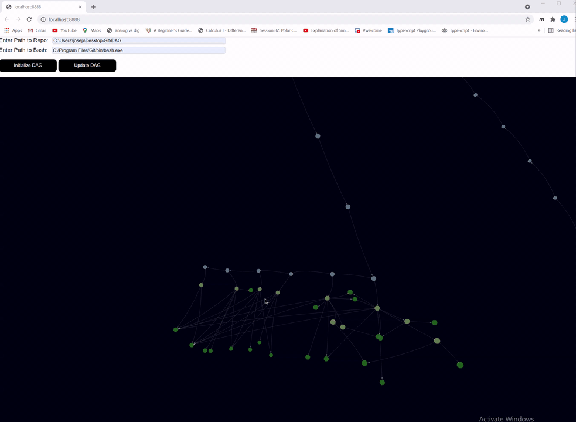

# Git-DAG

Note: This project is still in its early stages.

## What is This?

At its core Git is a content addressable database. Git-DAG allows you to view this database as a 3d model.

You can also view an object's content by pressing `ctrl+left-click`.

You can also view large projects (the frame rate will drop the larger the project is).

## Setup

- `clone` the repo
- make the data directory (`mkdir data`) and create a `content.txt`, `curr_objects.txt`, `prev_objects.txt`, `new_objects.txt` and `response.json`
- run `python serve.py`
