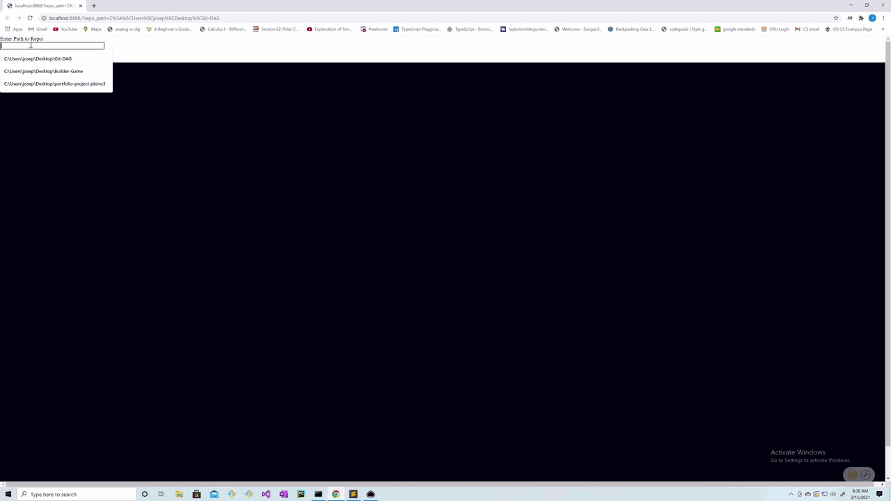
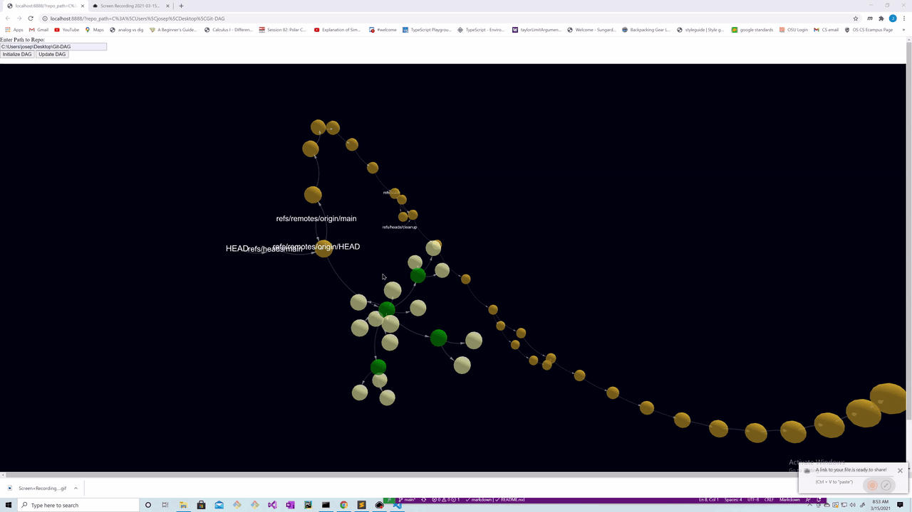

# Git-DAG

## What is This?

At its core Git is a content addressable database. Git-DAG allows you to view this database as a 3d model.

Right clicking a commit node expands the model, displaying the tree. You can also right click references, trees and blobs, which will display the objects content (runs git cat-file).

You can also use the tool to visualize what various git commands are doing.

## Setup

- clone the repo
- update `config.json` with the path to your `bash.exe` (assuming your a Windows user)
- open a terminal, `cd` to the cloned repo directory, run `mkdir data` and call `python view_dag.py` (this will start a local http server).
